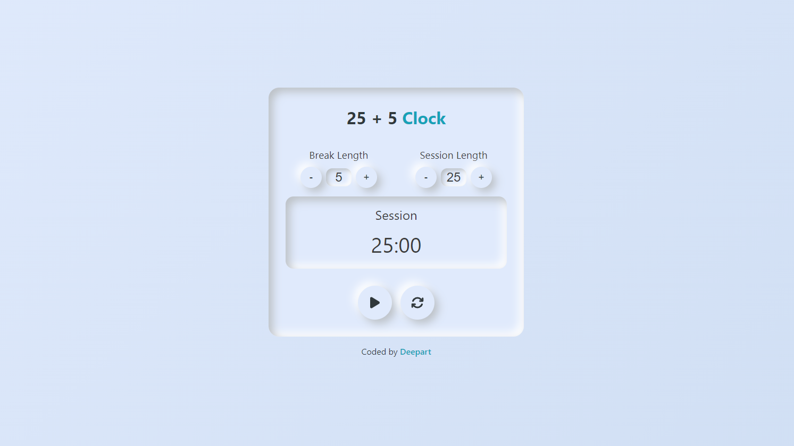

# 25 + 5 Clock

This project is a **25 + 5 Clock** application, built as part of a challenge to create a Pomodoro-style timer. The objective is to build a timer that allows users to set break and session lengths, start and stop the timer, and hear an alarm when the session or break ends. The app is expected to meet specific requirements and pass all provided tests.

## Table of Contents
- [Project Overview](#project-overview)
- [Screenshot](#screenshot)
- [Features](#features)
- [Installation](#installation)
- [Usage](#usage)

## Project Overview

The 25 + 5 Clock is a web application designed to help users manage their time using the Pomodoro technique. This technique involves alternating between work sessions (typically 25 minutes) and short breaks (typically 5 minutes). The application allows users to customize the length of their work sessions and breaks, start/pause the timer, and reset the clock.

You can view a similar example here: [Live Demo](https://bluedeepart.github.io/clock-25-5/).

## Screenshot



## Features

- **Break and Session Length Adjustment**: Users can adjust the length of breaks and sessions using increment and decrement buttons.
- **Timer Display**: The timer counts down in mm:ss format.
- **Start/Stop Timer**: Users can start, pause, and resume the countdown.
- **Reset Timer**: Resets the timer to the default values (25 minutes for sessions, 5 minutes for breaks) and stops any running countdown.
- **Automatic Transition**: Automatically switches between session and break when the timer reaches zero.
- **Audio Notification**: A beep sound plays when the timer reaches zero, signaling the end of a session or break.

## Installation

To install and run the project locally, follow these steps:

1. **Clone the repository**:
   ```bash
   git clone git@github.com:bluedeepart/clock-25-5.git
   cd clock-25-5
2. **Install dependencies:** Ensure you have Node.js installed, then run:
    ```bash
    npm install
3. Run the application:
    ```bash
    npm run dev
The application will be available at http://localhost:3000 in your browser.

## Usage
**Adjust Break/Session Length:** Use the increment/decrement buttons to set the desired break and session lengths.
**Start/Pause the Timer:** Click the "Start/Stop" button to begin the countdown or pause it if it's running.
**Reset the Timer:** Click the "Reset" button to stop the countdown and reset all values to their defaults.
**Automatic Switch:** The timer will automatically switch between session and break after reaching zero.
**Sound Notification:** When the timer reaches zero, a beep sound will notify you that the session or break is over.
