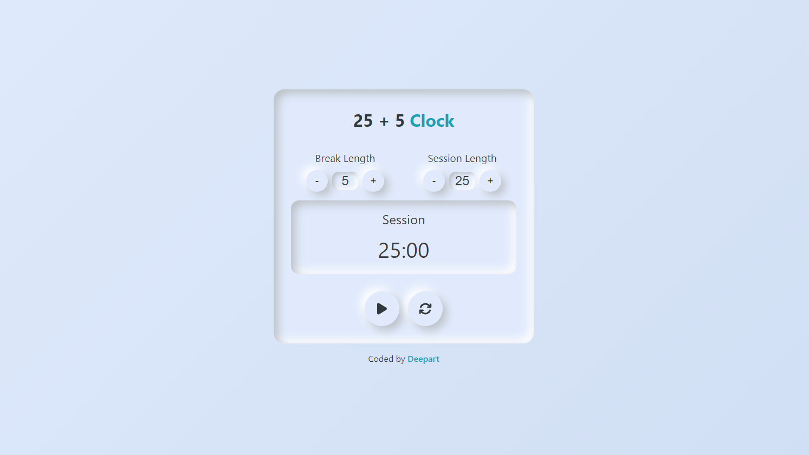

# 25 + 5 Clock

A responsive Pomodoro timer built as part of the **freeCodeCamp Front End Development Libraries** certification. The application helps users improve productivity by alternating between customizable work sessions and break periods.

## 📸 Preview

## ✨ Features

- Customizable session length
- Customizable break length
- Start, pause, and reset timer
- Audio notification on timer completion
- Responsive design
- Meets all freeCodeCamp project requirements

## 🛠 Tech Stack

- React
- JavaScript
- HTML5
- CSS3

## 🚀 Live Demo

https://bluedeepart.github.io/clock-25-5/

## 📄 License

This project was developed for educational purposes as part of the freeCodeCamp curriculum.
